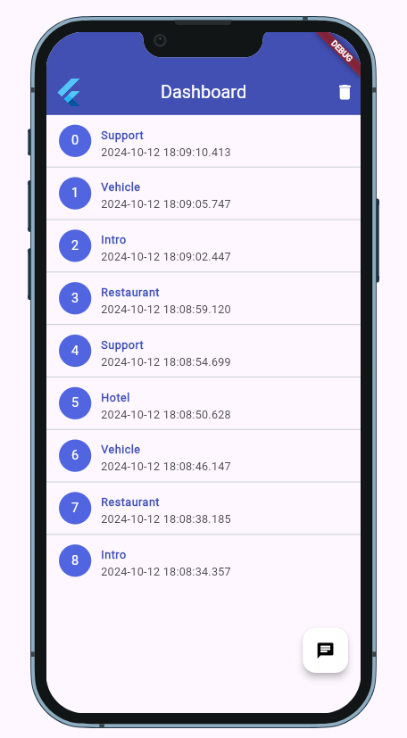
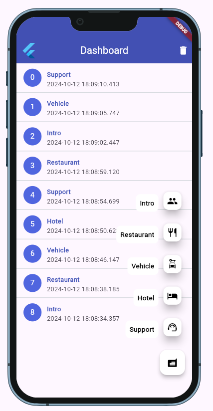
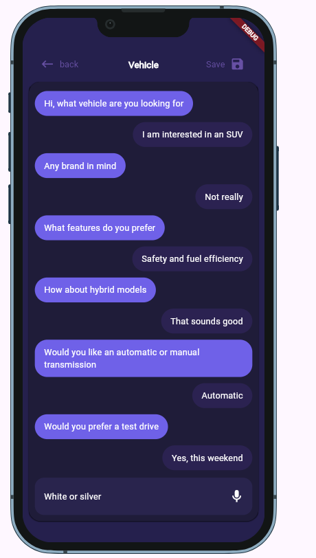
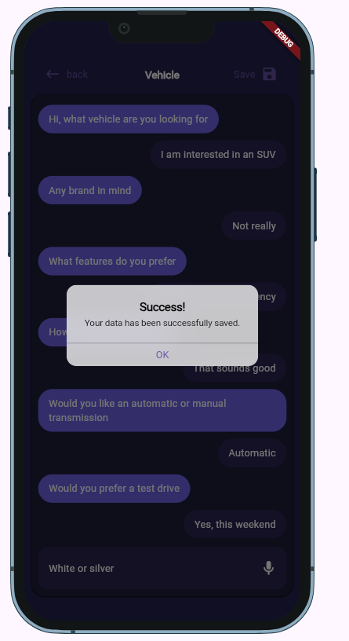
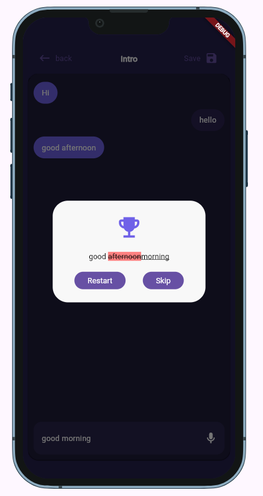

# 🤖🗣️ Bot-Human Chat

**Simple, Decent & Feature-Rich Chatting Application.**

---

## 📖Description
* A chat app made by Flutter.
* Flutter-based conversational application that helps users engage in realistic conversations using speech recognition. The app allows users to start new conversations, view conversation history, and receive real-time feedback on their speech.

---
## ✨ Features:

- **Speech Recognition**: Users can interact with the app using their voice, making conversations more natural.
- **Predefined Scenarios**: Engage in conversations in different contexts, such as restaurants, hotels, and support.
- **Conversation History**: Save and view past conversations for review and learning purposes.
- **User-Friendly Interface**: An intuitive UI that provides a seamless experience for users.
- **Predefined Conversation Starters**: Dummy API integration for interactive conversations.
- **Save Chats**: Users can save conversation history for future use.

- **And much more...**

---

## 🎨 Design Choices:

- **Flutter Framework**: Chosen for its cross-platform support and rich UI capabilities.
- **Speech-to-Text Integration**: Helps users get real-time feedback, enhancing their speaking skills.
-**Dummy API for Starters**: Makes the app more interactive by guiding users through conversations.
- **Save Chat Feature**: Allows users to revisit conversations, track progress, and learn from feedback.

---
## 📸 Screenshots:

**Actual app looks even better! 😃**

---

